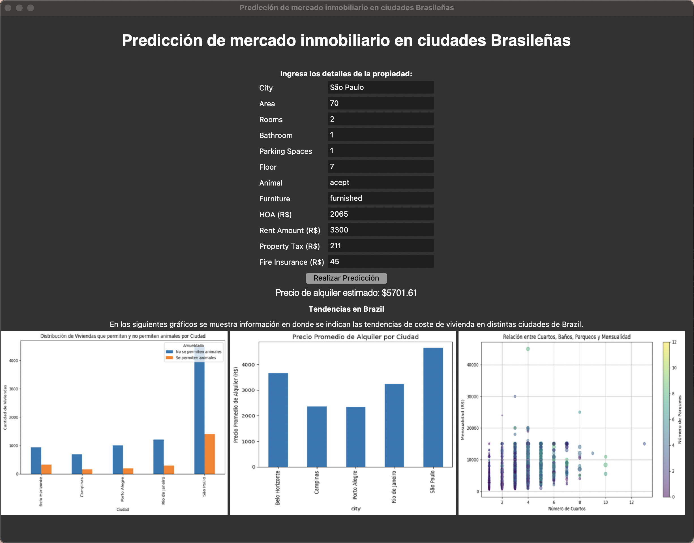

# Laboratorio 8
Data Science

**Integrantes:**
 - Paola Contreras, 20213
 - Paola de León, 20361

---

## **How to run**
Para la ejecución de la interfaz, abrir terminal y escribir el siguiente comando:
```
python3 UI.py
```

---
## **Evidencia**
### **Interfaz**
En la siguiente imágen se muestra el funcionamiento de la interfaz y el resultado de la predicción de un caso evaluado.



### **Reflexión**
[Click para visualizar PDF](./lab08_DS.pdf)